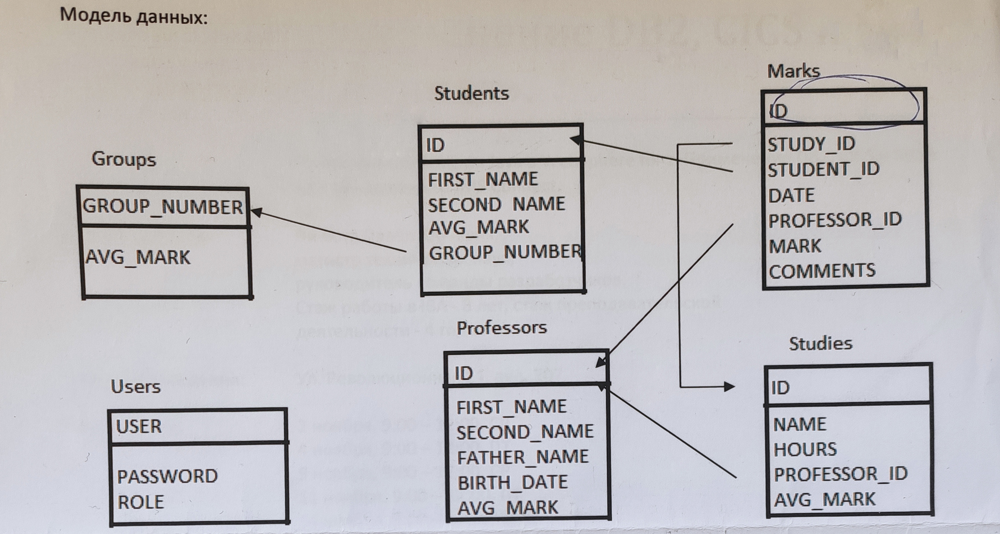
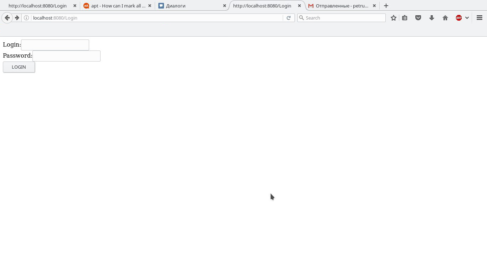
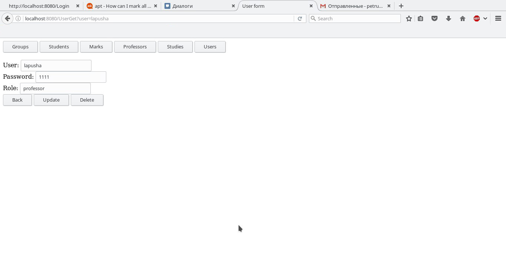
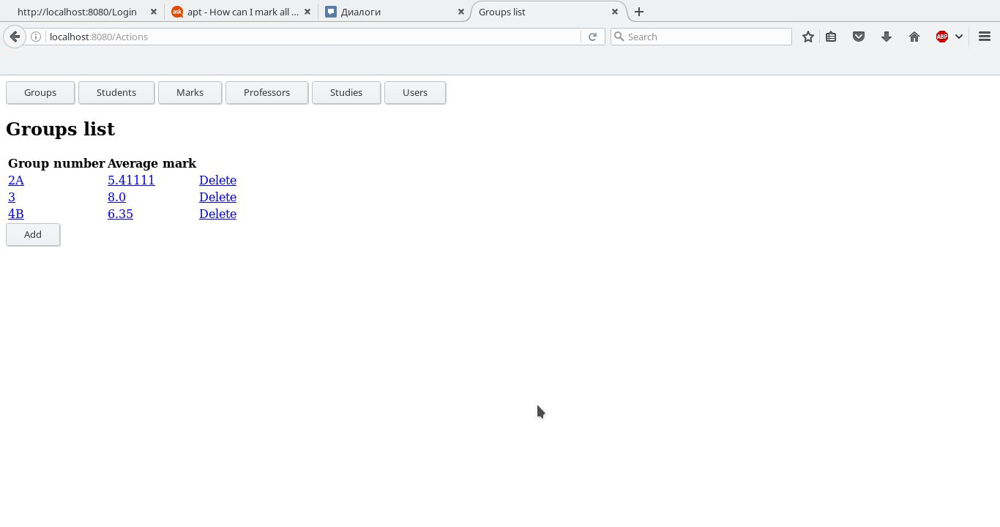
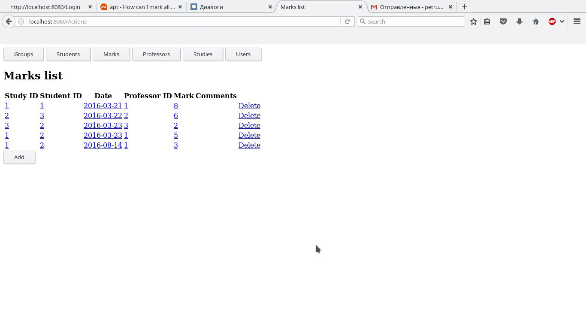
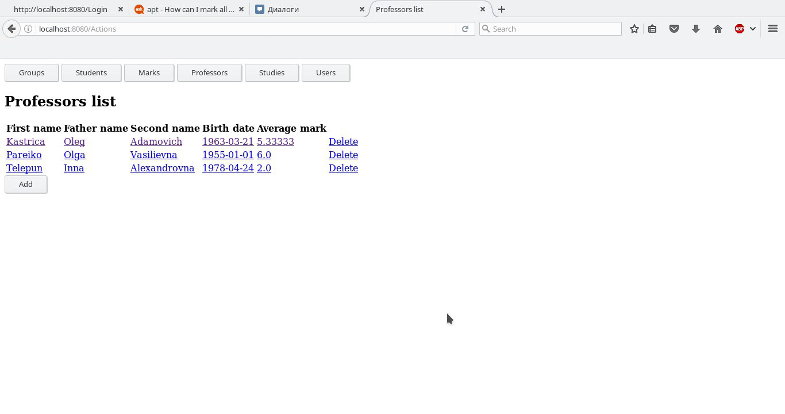
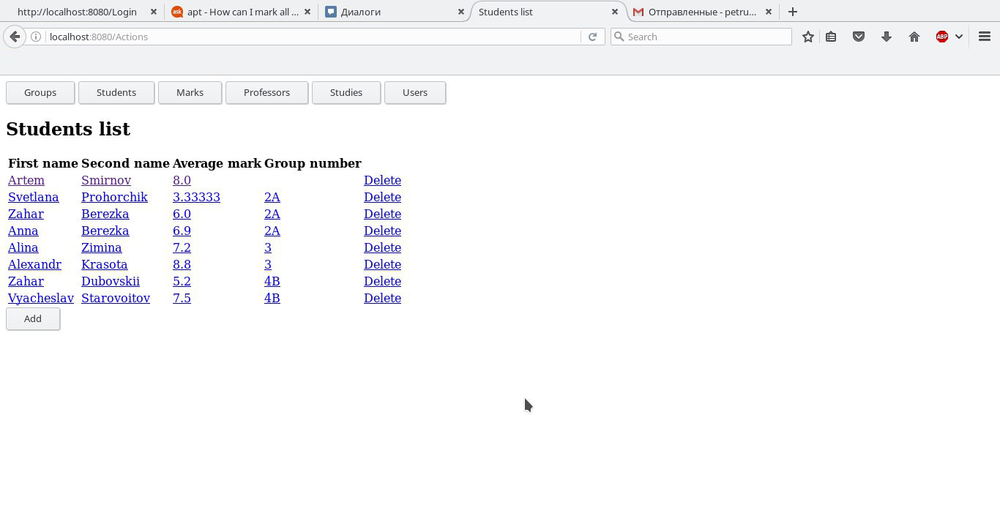
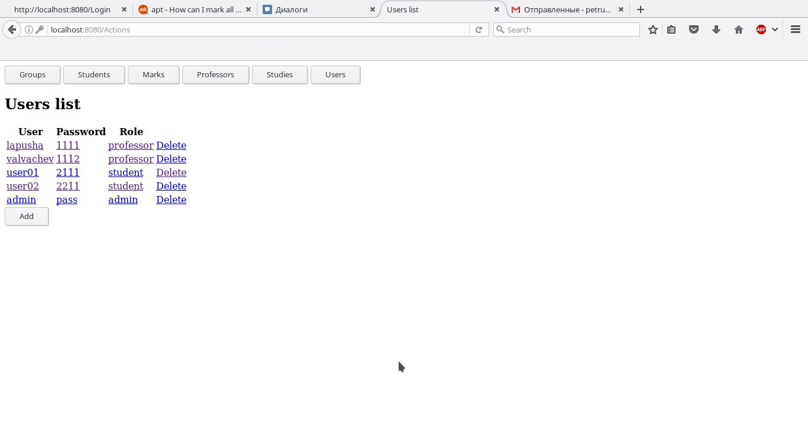

# StudentHelper

**Приложение "Электронный справочник успеваемости студентов университета".**

Требования:

1. Авторизация пользователей. З роли: Студент, Преподаватель, Админ.
2. Реализовать следующие страницы: 
	- Чтение, редактирование (для админа) групп.
	- Чтение, редактирование (для админа) студентов.
	- Чтение, добавление (для админа и преподавателя) оценок.
	- Чтение, редактирование (для админа) преподавателей.
	- Чтение, редактирование (для админа) предметов.
	- Чтение (для админов), редактирование (для админа) пользователей приложения.
3. Реализовать вызов хранимой процедуры пересчёта средних оценок для групп, студентов, предметов и преподавателей.
4. Реализовать возможность отправки сообщений админу для студентов и преподавателей. Чтение сообщений админом. Для реализации использовать МQ.
5. Реализация навигации по сайту.
6. Реализация динамического обновления контента сайта*

*в случае успешной реализации предыдущих (основных) требований 1-5.

Скриншоты реализации:

